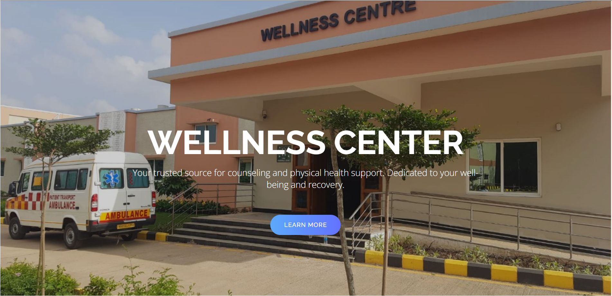
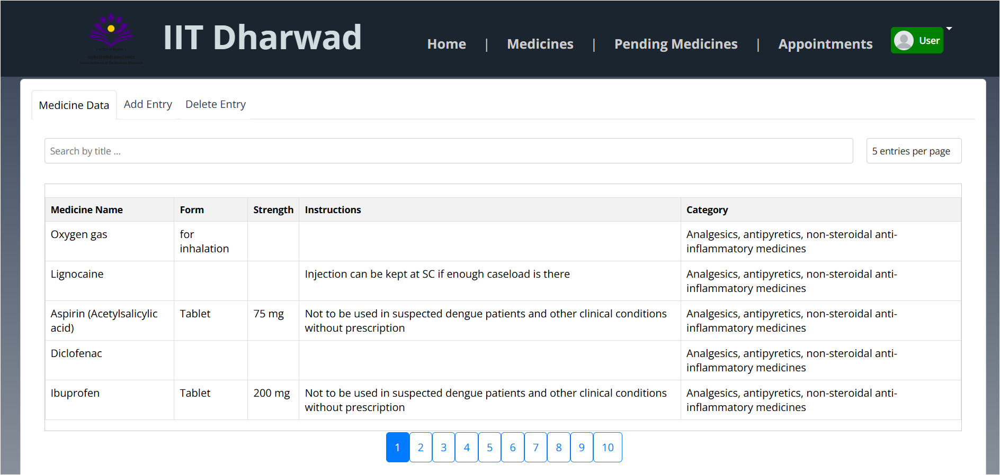
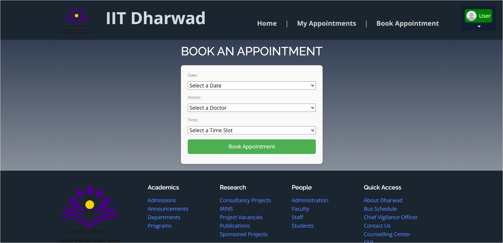
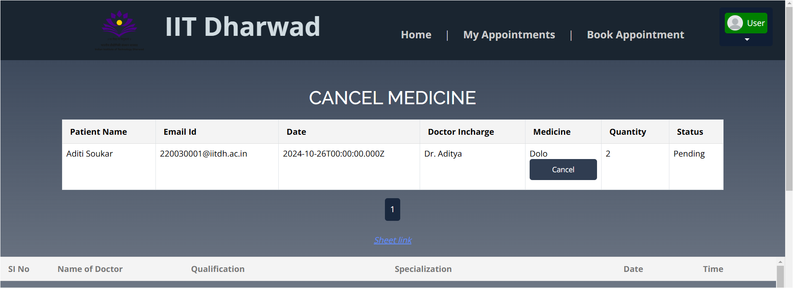

# WellnessConnect

A web application designed to streamline healthcare services within an institution. WellnessConnect serves as a centralized platform for students to book appointments, check doctor availability, and access emergency services, while allowing admins to manage medicine inventories, track medical supplies, and monitor appointments efficiently.

## Table of Contents
- [Project Description](#project-description)
- [Features](#features)
- [Installation](#installation)
- [Usage](#usage)
- [License](#license)
- [Contact](#contact)

## Project Description
WellnessConnect provides a user-friendly interface for both students and admins. Students can book appointments, view doctor availability, and manage their medications. Admins can oversee appointments, manage inventory, and ensure the smooth operation of healthcare services. The application aims to enhance the overall wellness experience for students by making healthcare services more accessible and organized.

## Features
- User authentication and authorization
- Real-time doctor availability
- Traffic indicator for appointment times
- Medicine inventory management
- Appointment booking and tracking
- Responsive design
- Admin and student dashboards with distinct functionalities

## Installation

### Prerequisites
- Node.js and npm
- MongoDB

### Steps
1. Clone the repository:
    ```bash
    git clone https://github.com/DantuluriMahima/Pandas_SleeplessCodingSaga2.0.git
    ```

2. Starting frontend:

    - Change directory:
        ```bash
        cd frontend
        ```
   
    - Install dependencies:
        ```bash
        npm install
        ```
   
    - Run the development server:
        ```bash
        npm start
        ```

3. Similarly for backend:

    - Change directory:
        ```bash
        cd backend
        ```
   
    - Install dependencies:
        ```bash
        npm install
        ```
   
    - Run the development server:
        ```bash
        npm start
        ```

4. Open your browser and navigate to `http://localhost:3000`.

## Usage
- **Home Page:** The landing page where users can access all features of the application.
- **Login Page:** Allows users to log in as either students or admins.
    - **Student Login:** Register using Roll No. and create your password.
    - **Admin Login:** Use roll number `1` and password `1`.
- **Student Dashboard:** Enables students to book appointments, track medications, and view available resources.
- **Admin Dashboard:** Allows admins to manage appointments, track inventory, and oversee the wellness services.

### Screenshots





## License
This project is licensed under the MIT License - see the [LICENSE](LICENSE) file for details.

## Contact
For questions or feedback, please reach out to us at [your-email@example.com].
